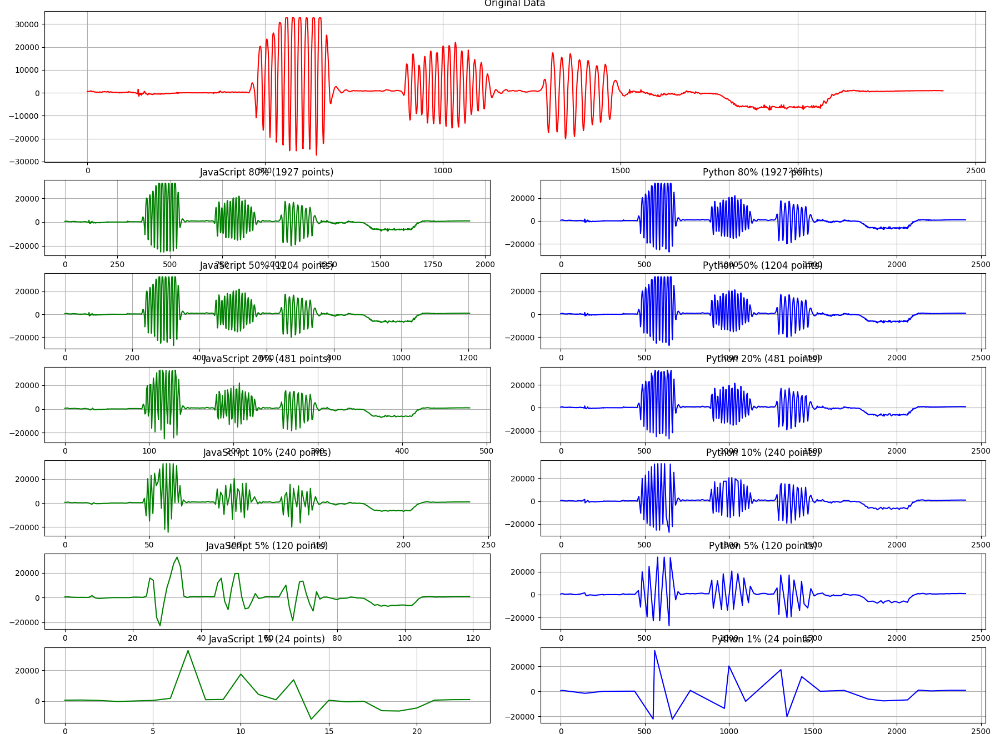

# Downsampling Comparison

This repository contains a javascript implementation of the LTTB algorithm written in surql specifically for use in surrealdb.

## Plot

Below is a plot comparing the original data with the downsampled data at various ratios for both the JavaScript (surrealdb embedded scripting function) and Python implementation.



## Full surql implementation example

Remember to enable scripting functions on your surrealdb instance.
If you want to enable strict mode you'll need to define the namespace and database first for the example to work as-is.

```sql
USE NS test DB test;

DEFINE TABLE motion SCHEMAFULL;
DEFINE FIELD ax ON TABLE motion TYPE array<number>;
DEFINE FIELD ay ON TABLE motion TYPE array<number>;
DEFINE FIELD az ON TABLE motion TYPE array<number>;
DEFINE FIELD gx ON TABLE motion TYPE array<number>;
DEFINE FIELD gy ON TABLE motion TYPE array<number>;
DEFINE FIELD gz ON TABLE motion TYPE array<number>;


DEFINE FUNCTION fn::lttb($data: array<number>, $n_out: int) {
    RETURN function($data, $n_out) {
        const [data, n_out] = arguments;
        const n = data.length;
        if (n_out >= n || n_out === 0) {
          return data.map((value, index) => [index, value]); // Return all points with indices
        }

        const sampled = new Array(n_out);
        const bucketSize = (n - 2) / (n_out - 2);

        let a = 0;
        sampled[0] = [0, data[0]]; // Always add the first point with its index
        sampled[n_out - 1] = [n - 1, data[n - 1]]; // Always add the last point with its index

        for (let i = 1; i < n_out - 1; i++) {
          const nextA = Math.floor((i + 1) * bucketSize) + 1;
          const avgRangeStart = Math.floor(i * bucketSize) + 1;
          const avgRangeEnd = nextA < n ? nextA : n;

          let avg = 0;

          for (let j = avgRangeStart; j < avgRangeEnd; j++) {
            avg += data[j];
          }
          const avgRangeLength = avgRangeEnd - avgRangeStart;
          avg /= avgRangeLength;

          const rangeOffs = Math.floor((i - 1) * bucketSize) + 1;
          const rangeTo = Math.floor(i * bucketSize) + 1;

          let maxArea = -1;
          let maxAreaPoint = a;

          const pointA = data[a];

          for (let j = rangeOffs; j < rangeTo; j++) {
            const area = Math.abs(
              (pointA - avg) * (data[j] - pointA) -
              (pointA - data[j]) * (avg - pointA)
            );

            if (area > maxArea) {
              maxArea = area;
              maxAreaPoint = j;
            }
          }

          sampled[i] = [maxAreaPoint, data[maxAreaPoint]];
          a = maxAreaPoint;
        }

        return sampled;
      };
};

CREATE motion:id CONTENT {
	ax: [1, 2, 3, 4, 5, 6, 7, 8, 9, 10],
	ay: [],
	az: [],
	gx: [],
	gy: [],
	gz: [],
};

SELECT fn::lttb(ax, 5) FROM motion:id;
```

The last SELECT statement returns the following:

```
[
    {"fn::lttb": [
            [0f, 1f],
            [1f, 2f],
            [3f, 4f],
            [6f, 7f],
            [9f, 10f]
        ]
    }
]
```

## How to run the test

```bash
pip install -r requirements.txt
python main.py
```

If you're using Rust for querying surrealdb, check the code in src/lib.rs. The code there may be helpful.
